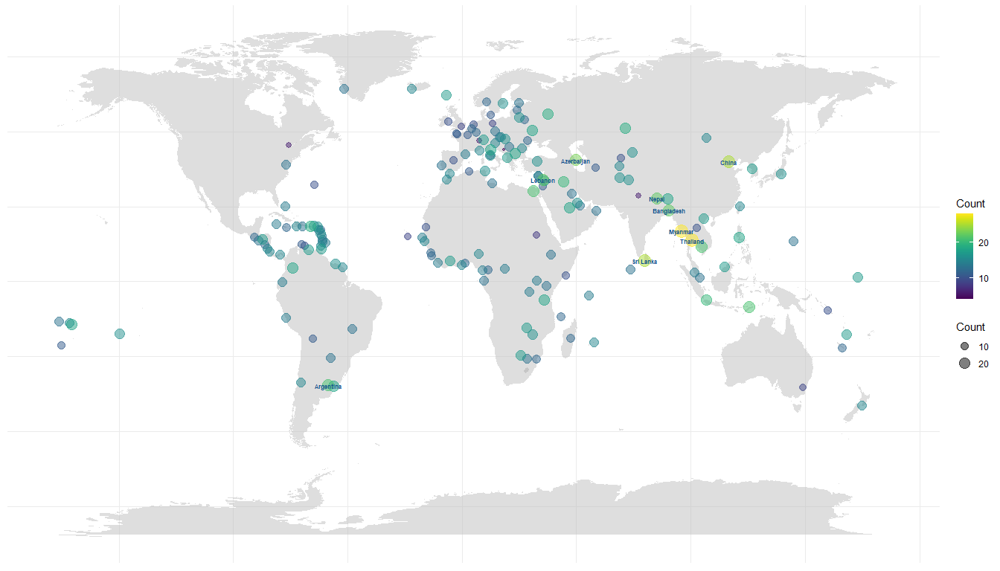
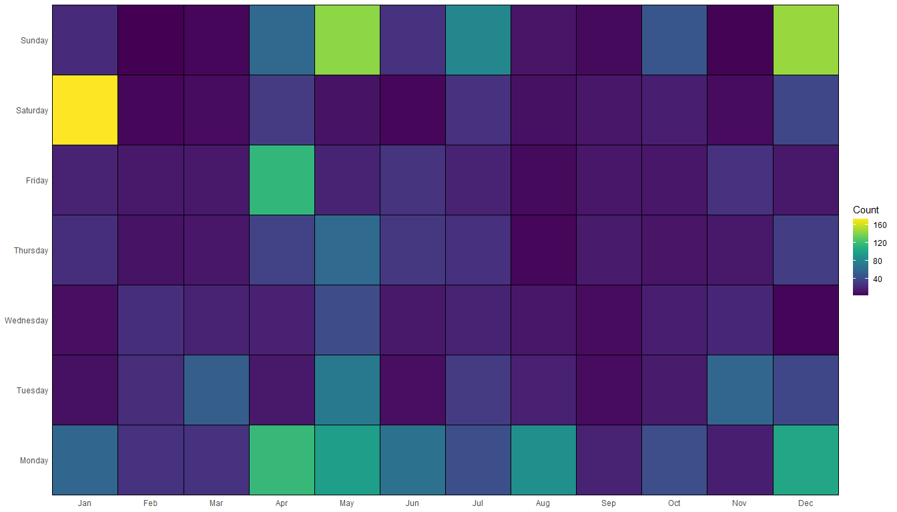
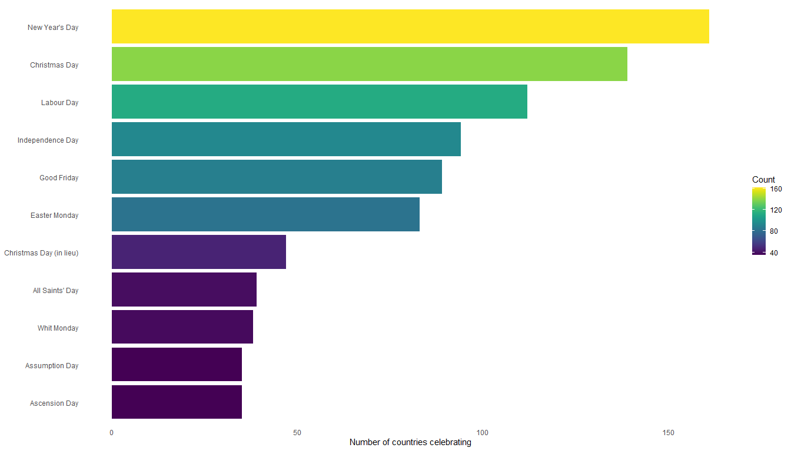

Public Holidays in every country in 2022
================
Jolie Pham

# Load packages

``` r
library(readr)
library(tidyverse)
library(ggplot2)
library(ggrepel)
library(plotly)
library(magrittr)
library(here)
library(stringr)
library(maps)
library(viridis)
library(hrbrthemes)
library(countrycode)
```

``` r
#load dataset
holiday <- read_csv("holiday_calendar.csv")

# count holidays by country
holidays_per_country <- holiday %>%
  # capitalise
  mutate(Country = str_to_title(holiday$Country)) %>%
  # replace dash with space and lowercase 'And'
  mutate(Country = str_replace_all(Country, c("-" = " ", 
                                              "And" = "and"))) %>%
  group_by(Country) %>%
  filter(Type %in% c("National Holiday", "Federal Holiday", "Public Holiday", "Government Holiday", "Bank Holiday", "NA")) %>%
  summarise(Count = n())

# load map data for background
mapdata <- map_data("world") %>% 
  rename(country = region)

# load world cities data to locate the bubbles
cities <- world.cities %>% 
  filter(capital == 1) %>%
  rename(Country = country.etc)

# check on the country names mismatches
mismatch_1 <- anti_join(holidays_per_country, cities, by = "Country")
mismatch_2 <- anti_join(cities, holidays_per_country, by = "Country")

# recode to match names
holidays_per_country$Country <- recode(holidays_per_country$Country,
                                       "andorra" = "Andorra",
                                       "Bonaire St Eustatius Saba" = "Netherlands Antilles",
                                       "Congo" = "Congo Democratic Republic",
                                       "Guernsey" = "Guernsey and Alderney",
                                       "Isle Of Man" = "Isle Of Man",
                                       "Lao" = "Laos",
                                       "South Korea" = "Korea South",
                                       "United Kingdom" = "UK",
                                       "Usa" = "USA")

# get 10 countries with the most holidays
holidays_per_country %>%
slice_max(n = 10, order_by = Count) %>%
select(Country)

# convert to list
top_10 <- c("Macau", "Myanmar", "Thailand", "China", "Sri Lanka", "Azerbaijan", "Bangladesh", "Lebanon", "Nepal", "Argentina" )

# joining 2 tables by `Country`
holidays_map <- left_join(holidays_per_country, cities, by = "Country") %>%
  mutate(Continent = countrycode(sourcevar = Country,
                            origin = "country.name",
                            destination = "continent"))

  
# reorder and add text for plotly
holidays_map <- holidays_map %>% 
  drop_na() %>%
  arrange(Count) %>%
  mutate(name = factor(Country, unique(Count))) %>%
  mutate(mytext = paste(
    "Country: ", Country, "\n", 
    "Number of Holidays: ", Count, sep="")) %>%
  mutate(label = case_when(Country %in% top_10 ~ Country,
                           TRUE ~ ""))
```

## Column

**Have you ever wondered which country has the most public holidays in
the world?**

The **bubble world map** helps answer the question, with top 10
countries displayed. You can also zoom in any particular area with the
lasso tool to see the number of public holidays in other countries.

The **heatmap** explores the month and day that have the most holidays.
May seems to be the most festive month this year. For the exact number
of holidays for each day of the month, you can hover the cursor above
each of the tile.

There are some holidays that are widely enjoyed across the glove as
shown in the **bar chart** and it’s only to be expected that Christmas
and New Year Day are one of those. You can also hover the cursor to bars
to get more information about the top 10 holidays.

**About the dataset**

The data was scraped from Office Holidays website and published on
Kaggle by user Kanawattanachai (2022). [Click to
view](https://www.kaggle.com/datasets/prasertk/public-holidays-in-every-country-in-2022)

*Notes: These visualisations do not take into account regional holidays
or festivals that are not public holiday*

## Row

### Number of Public Holidays in Each Country in 2022

``` r
p1 <- ggplot() +
  # world map background
  geom_polygon(data = mapdata, aes(x = long, y = lat, group = group), fill = "grey", alpha = 0.5) +
  # bubbles chart on top
  geom_point(data = holidays_map, aes(x = long, y = lat, size = Count, color = Count, text = mytext), alpha = 0.5) +
  # show countries with the most holidays
  geom_text(data = holidays_map, aes(x = long, y = lat, label = label), 
            color = "dodgerblue4", size = 2, fontface = "bold") +
  # color map
  scale_colour_viridis(option = "D") +
  # theme and hide details to make the map looks cleaner
  theme_minimal() +
  theme(axis.text.x = element_blank(),
        axis.text.y = element_blank(),
        axis.ticks = element_blank(),
        axis.title.x = element_blank(),
        axis.title.y = element_blank(),
        rect = element_blank())
```

    ## Warning in geom_point(data = holidays_map, aes(x = long, y = lat, size =
    ## Count, : Ignoring unknown aesthetics: text

``` r
p1
```

<!-- -->

## Column

### Holidays by month and day in 2022

``` r
# extract month to a separate column
holiday$Month <- factor(format(holiday$Date,"%b"),
                           levels = c("Jan", "Feb", "Mar", "Apr", "May", "Jun", "Jul", "Aug", "Sep", "Oct", "Nov", "Dec"))
# extract day to a separate column
holiday$Day <- factor(holiday$Day, levels = c("Monday", "Tuesday", "Wednesday", "Thursday", "Friday", "Saturday", "Sunday"))

# number of holidays by month and day of the week
holidays_day_month <- holiday %>%
  filter(Type %in% c("National Holiday", "Federal Holiday", "Public Holiday", "Government Holiday", "Bank Holiday")) %>%
  group_by(Month, Day) %>%
  summarise(Count = n())
```

    ## `summarise()` has grouped output by 'Month'. You can override using the
    ## `.groups` argument.

``` r
# visualisation
p2 <- ggplot(data = holidays_day_month, aes(x = Month, y = Day, fill = Count)) +
      geom_tile(colour = "black") +
      # color map
      scale_fill_viridis(option = "D") +
      theme_minimal() +
      # remove the tile to make the plot looks cleaner
      theme(axis.title.x = element_blank(),
            axis.title.y = element_blank(),
            panel.grid.major = element_blank(), 
            panel.grid.minor = element_blank(),
            panel.background = element_blank()) + 
      # expand the graph to the border of 2 axes
      scale_x_discrete(expand = c(0, 0)) + 
      scale_y_discrete(expand = c(0, 0))

p2
```

<!-- -->

### Top 10 global holidays in 2022 that are celebrated by the most countries

``` r
# get 10 of most popular holidays 
top_holidays <- holiday %>%
  filter(Type %in% c("National Holiday", "Federal Holiday", "Public Holiday", "Government Holiday", "Bank Holiday")) %>%
  group_by(`Holiday Name`) %>%
  summarise(Count = n()) %>%
  slice_max(n = 10, order_by = Count)

# text to display in plotly
top_holidays <- top_holidays %>%
  mutate(mytext = case_when(
    `Holiday Name` == "New Year's Day" ~ "A festival celebrates the first day of 
    the year in the modern Gregorian calendar (Wikipedia 2022)",
    `Holiday Name` == "Christmas Day" ~ "An annual festival commemorating the birth
    of Jesus Christ, observed as a religious and cultural celebration (Wikipedia 2022)",
    `Holiday Name` == "Labour Day" ~ "An annual holiday to celebrate the achievements
    of workers and has its origins in the labour union movement (Wikipedia 2022)",
    `Holiday Name` == "Independence Day" ~ "An annual event commemorating the 
    anniversary of a nation's independence or statehood (Wikipedia 2022)",
    `Holiday Name` == "Good Friday" ~ "A Christian holiday commemorating the crucifixion
    of Jesus and his death at Calvary (Wikipedia 2022)",
    `Holiday Name` == "Easter Monday" ~ "The day after Easter Sunday in either the Eastern
    or Western Christian traditions. It is the second day of Eastertide (Wikipedia 2022)",
    `Holiday Name` == "Christmas Day (in lieu)" ~ "If Christmas Day falls on a weekend,
    then the next working day after 25 December is observed as a public holiday (Office Holidays 2022)",
    `Holiday Name` == "All Saints' Day" ~ "A Christian solemnity celebrated in honour
    of all the saints of the church, whether they are known or unknown (Wikipedia 2022)",
    `Holiday Name` == "Whit Monday" ~ "Commemorates the coming of the Holy Spirit 
    in the form of flames to the Apostles (Office Holidays 2022)",
    `Holiday Name` == "Assumption Day" ~ "A day commemorating the belief that when Mary,
    the mother of Jesus Christ, died, her body was assumed into heaven (Office Holidays 2022)",
    `Holiday Name` == "Ascension Day" ~ "A day commemorates the Christian belief of the
    bodily Ascension of Jesus into heaven (Wikipedia 2022)",
    TRUE ~ "NA"))
           
           
# visualisation
p3 <- ggplot(data = top_holidays, aes(x = reorder(`Holiday Name`, Count), y = Count, fill = Count, text = mytext)) +
      geom_bar(stat = "identity") +
      scale_fill_viridis(option = "D") +
      # flip for the holiday names to be shown fully
      coord_flip() +
      theme_minimal() + 
      theme(axis.title.y = element_blank(),
            panel.grid.major = element_blank(), 
            panel.grid.minor = element_blank(),
            panel.background = element_blank()) +
      labs(y = "Number of countries celebrating") 

p3
```

<!-- -->
